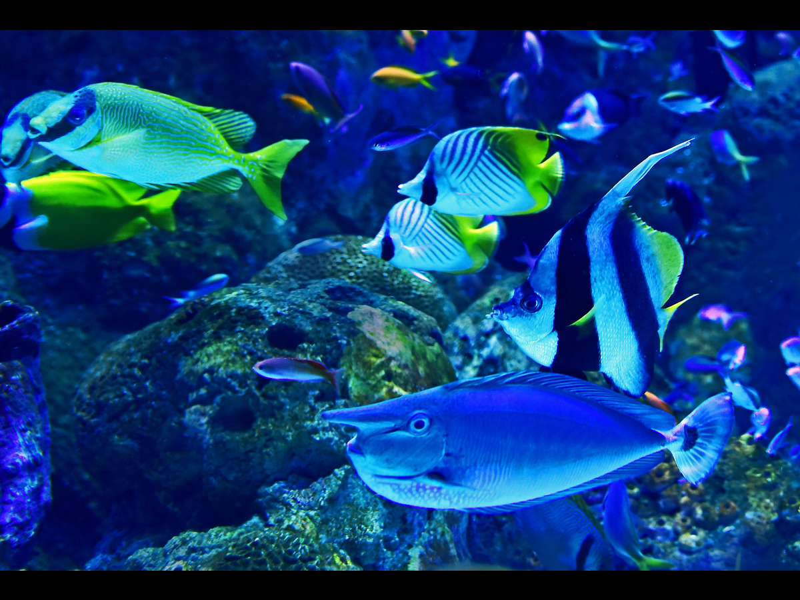

# AquaLuxe WordPress Theme

AquaLuxe is a premium WordPress theme designed specifically for ornamental fish farming businesses targeting both local and international markets. The theme combines elegant design with powerful functionality to create a stunning online presence for aquarium businesses, fish breeders, and aquatic supply stores.



## Features

### 🌊 Responsive Design
- Mobile-first approach ensures perfect display on all devices
- Fluid layouts and flexible grids adapt to any screen size
- Touch-friendly navigation and interactive elements

### 🌓 Dark Mode
- Toggle between light and dark modes
- User preference persistence with localStorage
- Automatic detection of system preference
- Smooth transition between modes

### 🛒 WooCommerce Integration
- Custom styling for shop pages and product displays
- Enhanced product galleries with zoom and lightbox
- Optimized cart and checkout experience
- Product quick view functionality
- Wishlist feature for saving favorite products

### 📱 Custom Post Types
- Services: Showcase your aquarium maintenance and setup services
- Events: Promote workshops, exhibitions, and community gatherings
- Projects: Display your custom aquarium installations and designs
- Testimonials: Share customer feedback and success stories
- Team Members: Introduce your staff and experts

### 🌐 Multilingual Support
- Ready for translation with .pot files included
- Compatible with WPML, Polylang, and other translation plugins
- RTL support for languages like Arabic and Hebrew

### 🔍 SEO Optimized
- Schema.org markup for enhanced search engine visibility
- Clean, semantic HTML structure
- Fast loading times for better search rankings
- Optimized meta tags and heading structure

### 🎨 Customizer Options
- Extensive theme customization through WordPress Customizer
- Color scheme controls with live preview
- Typography options with Google Fonts integration
- Layout settings for header, footer, and content areas

### 🛠️ Admin Interface
- Custom theme info page with documentation
- Dashboard widget with quick links and resources
- Intuitive options panel for theme settings

## Technical Details

### Core Technologies
- **WordPress**: 5.9+
- **PHP**: 7.4+
- **MySQL**: 5.6+
- **jQuery**: Latest version included
- **Tailwind CSS**: For responsive and utility-first styling
- **Alpine.js**: For interactive UI components

### Browser Support
- Chrome (latest)
- Firefox (latest)
- Safari (latest)
- Edge (latest)
- Opera (latest)

## Installation

1. Upload the `aqualuxe-theme` folder to the `/wp-content/themes/` directory
2. Activate the theme through the 'Themes' menu in WordPress
3. Navigate to Appearance > Customize to configure theme options
4. Import demo content (optional) via the theme's admin page

## Theme Structure

```
aqualuxe-theme/
├── assets/
│   ├── css/
│   │   ├── main.css
│   │   └── woocommerce.css
│   ├── js/
│   │   ├── main.js
│   │   ├── dark-mode.js
│   │   ├── navigation.js
│   │   ├── quick-view.js
│   │   ├── wishlist.js
│   │   └── slider.js
│   ├── images/
│   └── fonts/
├── inc/
│   ├── admin/
│   │   └── admin-functions.php
│   ├── customizer/
│   │   └── customizer.php
│   ├── helpers/
│   │   ├── template-functions.php
│   │   └── template-tags.php
│   ├── widgets/
│   │   └── class-aqualuxe-recent-posts-widget.php
│   ├── post-types.php
│   └── woocommerce.php
├── templates/
│   └── parts/
│       ├── content.php
│       ├── content-none.php
│       ├── page-header.php
│       └── hero.php
├── 404.php
├── archive.php
├── author.php
├── footer.php
├── front-page.php
├── functions.php
├── header.php
├── index.php
├── page.php
├── search.php
├── searchform.php
├── sidebar.php
├── single.php
├── style.css
├── README.md
└── screenshot.png
```

## Customization

### Theme Options

Access theme options via Appearance > Customize in your WordPress admin panel. Available customization sections include:

1. **Site Identity**: Logo, site title, tagline, and favicon
2. **Colors**: Primary, secondary, and accent color schemes
3. **Typography**: Font families, sizes, and weights
4. **Layout Options**: Content width, sidebar position, and grid settings
5. **Header Settings**: Navigation style, sticky header, and top bar options
6. **Footer Settings**: Widget areas, copyright text, and payment icons
7. **Blog Options**: Post meta display, featured images, and archive layouts
8. **WooCommerce Settings**: Product grids, shop page layout, and checkout options
9. **Homepage Sections**: Control visibility and content of homepage sections

### Custom CSS

For advanced customization, you can add custom CSS via:

1. Appearance > Customize > Additional CSS
2. A child theme (recommended for extensive modifications)

### Child Theme Development

For significant customizations, we recommend creating a child theme:

1. Create a new folder named `aqualuxe-child` in your `/wp-content/themes/` directory
2. Create a `style.css` file with the following header:

```css
/*
Theme Name: AquaLuxe Child
Theme URI: https://example.com/aqualuxe-child/
Description: Child theme for AquaLuxe
Author: Your Name
Author URI: https://example.com/
Template: aqualuxe-theme
Version: 1.0.0
Text Domain: aqualuxe-child
*/
```

3. Create a `functions.php` file to enqueue parent and child theme styles:

```php
<?php
function aqualuxe_child_enqueue_styles() {
    wp_enqueue_style('aqualuxe-style', get_template_directory_uri() . '/style.css');
    wp_enqueue_style('aqualuxe-child-style', get_stylesheet_uri(), array('aqualuxe-style'));
}
add_action('wp_enqueue_scripts', 'aqualuxe_child_enqueue_styles');
```

## WooCommerce Integration

AquaLuxe is fully compatible with WooCommerce and includes custom styling for all shop elements. The theme enhances the standard WooCommerce functionality with:

- Custom product grids and list views
- Enhanced product galleries with zoom and lightbox
- Quick view modal for product details
- Wishlist functionality for saving favorite products
- Mini-cart with AJAX updates
- Optimized checkout process
- Custom order tracking and account pages

## Support and Documentation

For detailed documentation and support, please visit:

- **Documentation**: [https://example.com/aqualuxe-docs/](https://example.com/aqualuxe-docs/)
- **Support Forum**: [https://example.com/aqualuxe-support/](https://example.com/aqualuxe-support/)
- **Video Tutorials**: [https://example.com/aqualuxe-tutorials/](https://example.com/aqualuxe-tutorials/)

## Credits

AquaLuxe theme uses the following open-source libraries and resources:

- [Tailwind CSS](https://tailwindcss.com/) - Utility-first CSS framework
- [Alpine.js](https://alpinejs.dev/) - Lightweight JavaScript framework
- [Swiper](https://swiperjs.com/) - Modern mobile touch slider
- [Heroicons](https://heroicons.com/) - Beautiful hand-crafted SVG icons
- [Google Fonts](https://fonts.google.com/) - Web fonts

## License

AquaLuxe is licensed under the GPL v2 or later. You can use it for both personal and commercial projects.

## Changelog

### Version 1.0.0 - August 9, 2025
- Initial release